# CreditSense AI

**Machine Learning Applications in Financial Leasing**

[](https://opensource.org/licenses/MIT)
[](https://www.python.org/downloads/)
[](https://nextjs.org/)
[](https://fastapi.tiangolo.com/)
[](https://www.typescriptlang.org/)

## 📋 Project Overview

CreditSense AI is a comprehensive machine learning platform designed to revolutionize financial leasing operations through intelligent automation and predictive analytics. The system integrates four powerful AI-driven components to provide actionable insights, risk assessment, performance tracking, and intelligent customer support for financial leasing institutions.

This research project focuses on applying advanced machine learning techniques to solve critical challenges in the financial leasing industry, including asset impairment prediction, default risk assessment, branch performance evaluation, and customer service automation.

### Key Components

1. **Impairment Analysis** - Automated assessment of asset impairments and 1-year Expected Credit Loss (ECL) prediction
2. **Default Risk Prediction** - ML-powered probability of default (PD) estimation for vehicle leasing customers
3. **Branch Performance Analysis** - Real-time evaluation and classification of branch performance
4. **AI-Driven Conversational Assistant** - Multimodal RAG-based chatbot for automated customer inquiries

---

## 🏗️ System Architecture

```mermaid
graph TB
    subgraph Frontend["🎨 Frontend Layer"]
        direction LR
        A["<b>Next.js 15.5 Application</b><br/><i>React 19 + TypeScript</i>"]
        A1["📊 Impairment<br/>Dashboard"]
        A2["🏢 Branch<br/>Analytics"]
        A3["⚠️ Default Risk<br/>Assessment"]
        A4["🤖 AI Chatbot<br/>Interface"]
    end
    
    subgraph Backend["⚙️ Backend Layer"]
        direction LR
        B["<b>FastAPI Server</b><br/><i>Async Processing</i>"]
        B1["🔍 Impairment<br/>Analysis API"]
        B2["📈 Branch<br/>Performance API"]
        B3["🎯 Default Risk<br/>Prediction API"]
        B4["💬 RAG-based<br/>Chatbot API"]
    end
    
    subgraph ML["🧠 ML Models Layer"]
        direction TB
        C1["<b>Impairment Models</b><br/>━━━━━━━━━━<br/>Stacking Ensemble ECL<br/>Gradient Boosting<br/>.pkl"]
        C2["<b>Branch Performance</b><br/>━━━━━━━━━━<br/>Random Forest<br/>XGBoost + SMOTE<br/>.pkl"]
        C3["<b>Default Risk Models</b><br/>━━━━━━━━━━<br/>Random Forest<br/>Logistic Regression<br/>Decision Tree + XGBoost<br/>.pkl"]
    end
    
    subgraph RAG["📚 RAG Architecture"]
        D1["<b>Vector Embeddings</b><br/>━━━━━━━━━━<br/>OpenAI Embeddings<br/>Similarity Search"]
        D2["<b>Knowledge Base</b><br/>━━━━━━━━━━<br/>Leasing Documents<br/>FAQs & Policies"]
        D3["<b>Multimodal Input</b><br/>━━━━━━━━━━<br/>Text + Voice STT<br/>Image OCR"]
    end
    
    subgraph Database["💾 Database Layer"]
        E["<b>Supabase</b><br/><i>PostgreSQL + pgvector</i>"]
        E1["👤 User Data<br/>Authentication"]
        E2["💳 Transaction<br/>Records"]
        E3["🏪 Branch Data<br/>Performance Metrics"]
        E4["💭 Chat History<br/>Vector Store"]
    end
    
    A1 -.->|REST API| B1
    A2 -.->|REST API| B2
    A3 -.->|REST API| B3
    A4 -.->|WebSocket/REST| B4
    
    B1 ==>|Inference| C1
    B2 ==>|Inference| C2
    B3 ==>|Inference| C3
    B4 ==>|RAG Pipeline| D1
    
    D1 <-->|Query| D2
    B4 -->|Process| D3
    
    B1 <-->|Query/Update| E
    B2 <-->|Query/Update| E
    B3 <-->|Query/Update| E
    B4 <-->|Query/Update| E
    
    C1 -.->|Features| E2
    C2 -.->|Features| E3
    C3 -.->|Features| E1
    
    classDef frontendStyle fill:#e3f2fd,stroke:#1976d2,stroke-width:2px,color:#000
    classDef backendStyle fill:#f3e5f5,stroke:#7b1fa2,stroke-width:2px,color:#000
    classDef mlStyle fill:#fff3e0,stroke:#f57c00,stroke-width:2px,color:#000
    classDef ragStyle fill:#e8f5e9,stroke:#388e3c,stroke-width:2px,color:#000
    classDef dbStyle fill:#fce4ec,stroke:#c2185b,stroke-width:2px,color:#000
    
    class A,A1,A2,A3,A4 frontendStyle
    class B,B1,B2,B3,B4 backendStyle
    class C1,C2,C3 mlStyle
    class D1,D2,D3 ragStyle
    class E,E1,E2,E3,E4 dbStyle
```



---

## 🔧 Technology Stack

### Frontend Stack
- **Framework**: Next.js 15.5.6 (App Router with Turbopack)
- **UI Library**: React 19.1.0
- **Language**: TypeScript 5+
- **Styling**: Tailwind CSS 4.0 (PostCSS)
- **UI Components**: Radix UI primitives
- **State Management**: TanStack Query (React Query) 5.90
- **Authentication**: Better Auth 1.3
- **File Upload**: UploadThing 7.7
- **HTTP Client**: Axios 1.13
- **Icons**: Lucide React 0.548
- **Theme**: next-themes 0.4
- **Notifications**: Sonner 2.0
- **Database Client**: Supabase JS 2.76
- **Email**: Nodemailer 7.0
- **LLM Integration**: OpenAI SDK 6.7

### Backend Stack
- **Framework**: FastAPI 0.104.1
- **Server**: Uvicorn 0.24.0 (ASGI)
- **Language**: Python 3.9+
- **API Documentation**: OpenAPI (Swagger UI)
- **Data Validation**: Pydantic 2.5.0
- **File Handling**: python-multipart 0.0.6

### Machine Learning Stack
- **Core Libraries**:
  - scikit-learn 1.3.2 (Classification, Ensemble methods)
  - pandas 2.1.3 (Data processing)
  - numpy 1.26.2 (Numerical computing)
  - joblib 1.3.2 (Model serialization)
- **Model Serialization**: Pickle (.pkl format)
- **Ensemble Techniques**: 
  - Stacking Ensemble (ECL prediction)
  - Gradient Boosting (Impairment)
  - Random Forest (Default risk, Branch performance)
  - XGBoost (Classification with class balancing)
  - Logistic Regression
  - Decision Trees
- **Imbalanced Data Handling**: SMOTE (Synthetic Minority Over-sampling)

### AI Conversational Assistant Stack
- **LLM Provider**: OpenAI API
- **Framework**: LangChain 0.0.335
- **LangChain Integration**: langchain-openai 0.0.2
- **Vector Database**: Supabase pgvector
- **Embeddings**: OpenAI Embeddings
- **Vector Storage**: ChromaDB 0.4.18
- **Architecture**: Retrieval-Augmented Generation (RAG)
- **Multimodal Support**:
  - Text processing (Natural Language Understanding)
  - Speech-to-Text (STT) for voice inputs
  - Text-to-Speech (TTS) for voice responses
  - Optical Character Recognition (OCR) for image inputs
- **Knowledge Base**: Domain-specific leasing documents and FAQs

### Database & Backend Services
- **Primary Database**: Supabase (PostgreSQL 15+)
- **Vector Extension**: pgvector (for embeddings)
- **Authentication**: Supabase Auth + Better Auth
- **Storage**: Supabase Storage
- **Real-time**: Supabase Realtime subscriptions
- **Environment Management**: python-dotenv 1.0.0
- **Database Client**: supabase-py 2.0.3, pg 8.16

---

## 📦 Project Dependencies

### Backend Dependencies (`requirements.txt`)

```txt
# Web Framework
fastapi==0.104.1
uvicorn[standard]==0.24.0
python-multipart==0.0.6

# Data Validation
pydantic==2.5.0

# Machine Learning
scikit-learn==1.3.2
pandas==2.1.3
numpy==1.26.2
joblib==1.3.2
xgboost==2.0.3
imbalanced-learn==0.11.0

# Database & Storage
supabase==2.0.3
python-dotenv==1.0.0

# AI & LangChain
openai==1.3.5
langchain==0.0.335
langchain-openai==0.0.2
chromadb==0.4.18

# Additional ML Libraries
scipy==1.11.4
matplotlib==3.8.2
seaborn==0.13.0

# API & Utilities
requests==2.31.0
python-jose[cryptography]==3.3.0
passlib[bcrypt]==1.7.4
```

### Frontend Dependencies (`package.json`)

```json
{
  "name": "creditsense-ai",
  "version": "1.0.0",
  "private": true,
  "scripts": {
    "dev": "next dev --turbopack -p 5173",
    "build": "next build --turbopack",
    "start": "next start -p 5173",
    "lint": "eslint",
    "type-check": "tsc --noEmit"
  },
  "dependencies": {
    "@radix-ui/react-alert-dialog": "^1.1.15",
    "@radix-ui/react-avatar": "^1.1.10",
    "@radix-ui/react-dialog": "^1.1.15",
    "@radix-ui/react-label": "^2.1.7",
    "@radix-ui/react-scroll-area": "^1.2.10",
    "@radix-ui/react-separator": "^1.1.7",
    "@radix-ui/react-slot": "^1.2.3",
    "@radix-ui/react-tabs": "^1.1.13",
    "@supabase/supabase-js": "^2.76.1",
    "@tanstack/react-query": "^5.90.5",
    "@tanstack/react-query-devtools": "^5.90.2",
    "@types/pg": "^8.15.5",
    "@uploadthing/react": "^7.3.3",
    "axios": "^1.13.1",
    "better-auth": "^1.3.32",
    "class-variance-authority": "^0.7.1",
    "clsx": "^2.1.1",
    "handlebars": "^4.7.8",
    "lucide-react": "^0.548.0",
    "next": "15.5.6",
    "next-themes": "^0.4.6",
    "nodemailer": "^7.0.10",
    "openai": "^6.7.0",
    "pg": "^8.16.3",
    "react": "19.1.0",
    "react-dom": "19.1.0",
    "sonner": "^2.0.7",
    "tailwind-merge": "^3.3.1",
    "uploadthing": "^7.7.4"
  },
  "devDependencies": {
    "@eslint/eslintrc": "^3",
    "@tailwindcss/postcss": "^4",
    "@types/node": "^20",
    "@types/nodemailer": "^7.0.3",
    "@types/react": "^19",
    "@types/react-dom": "^19",
    "eslint": "^9",
    "eslint-config-next": "15.5.6",
    "tailwindcss": "^4",
    "tw-animate-css": "^1.4.0",
    "typescript": "^5"
  }
}
```

---

## 🚀 Getting Started

### Prerequisites

- **Node.js**: 18.0+ and npm/yarn
- **Python**: 3.9 or higher
- **Supabase**: Active project with pgvector extension
- **OpenAI API**: Valid API key for chatbot functionality
- **Git**: Version control system

### Project Structure

```
creditsense-ai/
├── frontend/                 # Next.js frontend application
│   ├── app/                 # App router pages
│   ├── components/          # React components
│   ├── lib/                 # Utility functions
│   ├── public/              # Static assets
│   └── package.json
├── backend/                 # FastAPI backend
│   ├── api/                 # API routes
│   ├── models/              # ML model files (.pkl)
│   ├── services/            # Business logic
│   ├── ml_training/         # Model training scripts
│   ├── main.py              # FastAPI application
│   └── requirements.txt
├── docs/                    # Documentation
├── .gitignore
├── LICENSE
└── README.md
```

---

## ⚙️ Installation & Setup

### 1. Clone the Repository

```bash
git clone https://github.com/yourusername/creditsense-ai.git
cd creditsense-ai
```

### 2. Backend Setup

#### Create Virtual Environment

```bash
cd backend
python -m venv venv

# On Windows
venv\Scripts\activate

# On macOS/Linux
source venv/bin/activate
```

#### Install Python Dependencies

```bash
pip install --upgrade pip
pip install -r requirements.txt
```

#### Configure Environment Variables

Create a `.env` file in the `backend/` directory:

```env
# Supabase Configuration
SUPABASE_URL=your_supabase_project_url
SUPABASE_KEY=your_supabase_anon_key
SUPABASE_SERVICE_KEY=your_supabase_service_role_key

# OpenAI Configuration
OPENAI_API_KEY=your_openai_api_key

# FastAPI Configuration
API_HOST=0.0.0.0
API_PORT=8000
DEBUG=True

# Security
SECRET_KEY=your_secret_key_here
ALGORITHM=HS256
ACCESS_TOKEN_EXPIRE_MINUTES=30

# CORS
ALLOWED_ORIGINS=http://localhost:5173,http://localhost:3000
```

#### Setup ML Models Directory

```bash
mkdir -p models
```

Place your trained `.pkl` model files in the `models/` directory:

```
models/
├── ecl_stacking_ensemble.pkl
├── impairment_gradient_boosting.pkl
├── branch_performance_random_forest.pkl
├── branch_performance_xgboost.pkl
├── default_risk_random_forest.pkl
├── default_risk_logistic_regression.pkl
├── default_risk_decision_tree.pkl
└── default_risk_xgboost.pkl
```

#### Run Backend Server

```bash
uvicorn main:app --reload --host 0.0.0.0 --port 8000
```

The API will be available at: `http://localhost:8000`
- Swagger UI documentation: `http://localhost:8000/docs`
- ReDoc documentation: `http://localhost:8000/redoc`

---

### 3. Frontend Setup

#### Navigate to Frontend Directory

```bash
cd ../frontend
```

#### Install Node Dependencies

```bash
npm install
# or
yarn install
```

#### Configure Environment Variables

Create a `.env.local` file in the `frontend/` directory:

```env
# API Configuration
NEXT_PUBLIC_API_URL=http://localhost:8000
NEXT_PUBLIC_API_WS_URL=ws://localhost:8000

# Supabase Configuration
NEXT_PUBLIC_SUPABASE_URL=your_supabase_project_url
NEXT_PUBLIC_SUPABASE_ANON_KEY=your_supabase_anon_key

# Better Auth
BETTER_AUTH_SECRET=your_better_auth_secret
BETTER_AUTH_URL=http://localhost:5173

# UploadThing
UPLOADTHING_SECRET=your_uploadthing_secret
UPLOADTHING_APP_ID=your_uploadthing_app_id

# OpenAI (for client-side features if needed)
NEXT_PUBLIC_OPENAI_API_KEY=your_openai_api_key
```

#### Run Development Server

```bash
npm run dev
# or
yarn dev
```

The application will be available at: `http://localhost:5173`

#### Build for Production

```bash
npm run build
npm run start
```

---

## 📊 Component Details

### 1. Impairment Analysis

The Impairment Analysis component predicts asset impairments and calculates 1-year Expected Credit Loss (ECL) for financial leasing portfolios.

#### ML Models & Techniques

- **ECL Prediction**: Stacking Ensemble (Meta-learner combining multiple base models)
- **Impairment Classification**: Gradient Boosting Classifier
- **Model Format**: Serialized .pkl files served via FastAPI

#### Features

- **1-Year ECL Forecasting**: Advanced ensemble methods for accurate credit loss estimation
- **Asset Health Scoring**: Multi-factor assessment of asset quality
- **Impairment Probability**: Binary classification with confidence scores
- **Historical Trend Analysis**: Time-series visualization of impairment patterns
- **Automated Risk Reporting**: Generated PDF/Excel reports with actionable insights
- **Portfolio-level Analytics**: Aggregated impairment metrics across asset classes

#### Technical Implementation

- Feature engineering from transaction records
- Preprocessing pipeline with normalization and encoding
- Real-time inference through FastAPI endpoints
- Integration with Supabase for historical data retrieval

---

### 2. Default Risk Prediction

Estimates the Probability of Default (PD) for vehicle leasing customers using ensemble machine learning models.

#### ML Models & Techniques

- **Random Forest** (Primary model - highest accuracy)
- **Logistic Regression** (Baseline probabilistic model)
- **Decision Tree** (Interpretable rules-based approach)
- **XGBoost** (Gradient boosting for complex patterns)

All models trained on financial and behavioral customer data with comprehensive feature engineering.

#### Features

- **Probability of Default (PD) Scoring**: Continuous probability score (0-1)
- **Risk Classification**: Customers categorized as Low, Medium, or High Risk
- **Feature Importance Analysis**: Key risk indicators identified and ranked
- **Real-time API Prediction**: 
  - Single customer evaluation
  - Batch prediction support
  - File upload (CSV/Excel) for bulk assessment
- **Risk Indicators**:
  - Arrears ratio and payment history
  - Loan-to-value metrics
  - Loan age and repayment patterns
  - Behavioral scoring (payment consistency)
  - Demographic factors

#### API Endpoints

```python
POST /api/v1/default-risk/predict          # Single prediction
POST /api/v1/default-risk/predict-batch    # Batch prediction
POST /api/v1/default-risk/predict-file     # File upload prediction
GET  /api/v1/default-risk/model-info       # Model metadata
```

#### Risk Score Interpretation

- **Low Risk**: PD < 0.3 (Green)
- **Medium Risk**: 0.3 ≤ PD < 0.7 (Yellow)
- **High Risk**: PD ≥ 0.7 (Red)

---

### 3. Branch Performance Analysis

ML-driven classification system to evaluate and predict branch performance in financial leasing operations.

#### ML Models & Techniques

- **Random Forest Classifier** (Multi-tree ensemble)
- **XGBoost Classifier** (Gradient boosting)
- **Gradient Boosting Classifier**
- **Logistic Regression** (Baseline)
- **Class Balancing**: SMOTE (Synthetic Minority Over-sampling Technique)

**Best Model Selection**: Automatic selection based on accuracy and F1-score with emphasis on NPL risk detection.

#### Features

- **Binary Classification**: Good (Performing) vs Poor (Under-performing/NPL Risk)
- **Performance Metrics**:
  - Revenue generation
  - Customer acquisition rate
  - Loan portfolio quality
  - Operational efficiency
  - NPL (Non-Performing Loan) ratio
  - Customer satisfaction scores
- **Prediction Modes**:
  - Single branch evaluation
  - Batch branch comparison
  - File-based bulk prediction
- **Confidence Scoring**: Probability scores for each classification
- **Early Risk Detection**: Proactive identification of under-performing branches
- **KPI Dashboards**: Visual analytics with trend forecasting

#### API Endpoints

```python
POST /api/v1/branch/predict                # Single branch
POST /api/v1/branch/predict-batch          # Multiple branches
POST /api/v1/branch/predict-file           # CSV/Excel upload
GET  /api/v1/branch/performance-metrics    # Historical metrics
GET  /api/v1/branch/model-performance      # Model accuracy stats
```

---

### 4. AI-Driven Conversational Assistant

Advanced RAG-based (Retrieval-Augmented Generation) multimodal chatbot designed to automate customer inquiries in financial leasing.

#### Architecture & Technology

**RAG Pipeline**:
1. **Document Ingestion**: Leasing documents, FAQs, policies stored as embeddings
2. **Query Processing**: Customer query converted to vector embedding
3. **Similarity Search**: Retrieval of top-k relevant documents from vector store
4. **Context Augmentation**: Retrieved documents injected into LLM context
5. **Response Generation**: LLM generates accurate, contextual responses

**Technology Stack**:
- **LLM**: OpenAI GPT-4/GPT-3.5-turbo
- **Embeddings**: OpenAI text-embedding-ada-002
- **Vector Store**: Supabase pgvector + ChromaDB
- **Orchestration**: LangChain framework
- **Multimodal Processing**:
  - **Text**: Direct natural language processing
  - **Voice**: Speech-to-Text (STT) → Text processing → Text-to-Speech (TTS)
  - **Images**: OCR extraction → Text processing

#### Features

- **Multimodal Input Support**:
  - Text-based chat interface
  - Voice input processing (STT)
  - Image upload and OCR analysis
  - Document upload and parsing
- **Intelligent Responses**:
  - Context-aware conversations
  - Multi-turn dialogue management
  - Intent recognition and classification
  - Semantic similarity matching
- **Domain Knowledge**:
  - Leasing procedures and eligibility criteria
  - Interest rates and installment plans
  - Required documentation
  - Branch locations and contact information
  - Payment methods and schedules
  - Policy details and compliance information
- **Conversation Management**:
  - Chat history persistence
  - Session management
  - User preference learning
- **Security & Privacy**:
  - Encrypted communication (HTTPS/WSS)
  - Role-based access control
  - PII data protection
  - Audit logging

#### API Endpoints

```python
POST /api/v1/chat/message                  # Send text message
POST /api/v1/chat/voice                    # Voice input (STT)
POST /api/v1/chat/image                    # Image OCR processing
GET  /api/v1/chat/history                  # Retrieve chat history
DELETE /api/v1/chat/session                # Clear session
POST /api/v1/chat/feedback                 # User feedback
```

#### Benefits

- **24/7 Availability**: Round-the-clock customer support
- **Cost Reduction**: Reduced dependency on human agents
- **Faster Response Times**: Instant automated replies
- **Consistency**: Uniform answers across all customer interactions
- **Scalability**: Handle unlimited concurrent conversations
- **Customer Satisfaction**: Quick, accurate, and helpful responses

---

## 🗄️ Database Schema

### Supabase Tables

#### Users Table
```sql
CREATE TABLE users (
  id UUID PRIMARY KEY DEFAULT uuid_generate_v4(),
  email VARCHAR(255) UNIQUE NOT NULL,
  full_name VARCHAR(255),
  role VARCHAR(50) DEFAULT 'user',
  created_at TIMESTAMP DEFAULT NOW(),
  updated_at TIMESTAMP DEFAULT NOW()
);
```

#### Transactions Table
```sql
CREATE TABLE transactions (
  id UUID PRIMARY KEY DEFAULT uuid_generate_v4(),
  user_id UUID REFERENCES users(id),
  amount DECIMAL(15, 2),
  transaction_type VARCHAR(50),
  status VARCHAR(50),
  arrears_amount DECIMAL(15, 2),
  payment_date DATE,
  created_at TIMESTAMP DEFAULT NOW()
);
```

#### Branches Table
```sql
CREATE TABLE branches (
  id UUID PRIMARY KEY DEFAULT uuid_generate_v4(),
  branch_name VARCHAR(255) NOT NULL,
  branch_code VARCHAR(50) UNIQUE,
  location VARCHAR(255),
  revenue DECIMAL(15, 2),
  npl_ratio DECIMAL(5, 4),
  customer_count INTEGER,
  performance_status VARCHAR(50),
  created_at TIMESTAMP DEFAULT NOW()
);
```

#### Chat History Table
```sql
CREATE TABLE chat_history (
  id UUID PRIMARY KEY DEFAULT uuid_generate_v4(),
  user_id UUID REFERENCES users(id),
  session_id VARCHAR(255),
  message TEXT,
  role VARCHAR(20), -- 'user' or 'assistant'
  created_at TIMESTAMP DEFAULT NOW()
);
```

#### Vector Embeddings Table (pgvector)
```sql
CREATE EXTENSION IF NOT EXISTS vector;

CREATE TABLE document_embeddings (
  id UUID PRIMARY KEY DEFAULT uuid_generate_v4(),
  document_name VARCHAR(255),
  content TEXT,
  embedding vector(1536), -- OpenAI embedding dimension
  metadata JSONB,
  created_at TIMESTAMP DEFAULT NOW()
);

CREATE INDEX ON document_embeddings USING ivfflat (embedding vector_cosine_ops);
```

---

## 🔒 Security & Authentication

### Authentication Methods

- **Supabase Auth**: Email/password authentication with JWT tokens
- **Better Auth**: Enhanced authentication with session management
- **Row-Level Security (RLS)**: Supabase policies for data access control

### Security Features

- **JWT Token-based Auth**: Stateless authentication with refresh tokens
- **HTTPS/TLS Encryption**: All API communications encrypted
- **CORS Configuration**: Restricted origins for API access
- **Input Validation**: Pydantic models for request validation
- **SQL Injection Prevention**: Parameterized queries via ORM
- **XSS Protection**: React's built-in sanitization
- **Rate Limiting**: API request throttling (planned)
- **Environment Variables**: Sensitive credentials in .env files
- **Password Hashing**: bcrypt for secure password storage

### Data Privacy

- **PII Protection**: Encryption of personally identifiable information
- **Audit Logging**: Comprehensive activity tracking
- **Data Retention Policies**: Configurable data lifecycle management
- **GDPR Compliance**: User data export and deletion capabilities

---

## 📈 Machine Learning Model Training

### Training Pipeline

All ML models are trained offline using historical leasing data and serialized as `.pkl` files for production deployment.

#### 1. Data Preparation

```bash
cd backend/ml_training
python data_preprocessing.py
```

- Data cleaning and validation
- Missing value imputation
- Outlier detection and treatment
- Feature scaling and normalization

#### 2. Feature Engineering

```bash
python feature_engineering.py
```

- Domain-specific feature creation
- Temporal features (loan age, payment frequency)
- Aggregated statistics (arrears ratio, payment consistency)
- Categorical encoding (one-hot, label encoding)

#### 3. Model Training

**Impairment Analysis**:
```bash
python train_impairment_models.py
```
- Stacking Ensemble for ECL prediction
- Gradient Boosting for impairment classification

**Default Risk Prediction**:
```bash
python train_default_risk_models.py
```
- Random Forest, Logistic Regression, Decision Tree, XGBoost
- Cross-validation and hyperparameter tuning
- Model comparison and selection

**Branch Performance**:
```bash
python train_branch_performance_models.py
```
- SMOTE for class balancing
- Random Forest, XGBoost, Gradient Boosting, Logistic Regression
- Performance metric evaluation (accuracy, F1, precision, recall)

#### 4. Model Evaluation

```bash
python evaluate_models.py
```

- Confusion matrix analysis
- ROC-AUC curve visualization
- Precision-Recall curves
- Feature importance ranking
- Model interpretability (SHAP values)

#### 5. Model Serialization

```bash
python serialize_models.py
```

Models saved using `joblib`:
```python
import joblib
joblib.dump(trained_model, 'models/model_name.pkl')
```

#### 6. Deployment

Copy serialized models to `backend/models/` directory and restart FastAPI server.

---

## 🧪 Testing

### Backend Testing

```bash
cd backend
pytest tests/ -v --cov=api --cov-report=html
```

### Frontend Testing

```bash
cd frontend
npm run test
npm run test:coverage
```

### API Testing

Use the Swagger UI at `http://localhost:8000/docs` or import the OpenAPI spec into Postman.

---

## 🚀 Deployment

### Backend Deployment (Docker)

```dockerfile
FROM python:3.9-slim

WORKDIR /app
COPY requirements.txt .
RUN pip install --no-cache-dir -r requirements.txt

COPY . .
EXPOSE 8000

CMD ["uvicorn", "main:app", "--host", "0.0.0.0", "--port", "8000"]
```

### Frontend Deployment (Vercel)

```bash
npm run build
vercel --prod
```

### Environment Variables (Production)

Ensure all production environment variables are configured in your hosting platform.
