# CreditSense AI

**Machine Learning Applications in Financial Leasing**

## 📋 Project Overview

CreditSense AI is a comprehensive machine learning platform designed to revolutionize financial leasing operations through intelligent automation and predictive analytics. The system integrates four powerful components to provide actionable insights, risk assessment, performance tracking, and intelligent customer support for financial leasing institutions.

### Key Features

- **Impairment Analysis**: Automated assessment of asset impairments and financial health monitoring
- **Branch Performance Analysis**: Real-time tracking and evaluation of branch-level metrics and KPIs
- **Default Risk Prediction**: ML-powered prediction models to assess customer default probability
- **AI-Based Chatbot**: Intelligent conversational assistant with knowledge base integration

## 🏗️ System Architecture

```mermaid
graph TB
    subgraph Frontend["🎨 Frontend Layer"]
        direction LR
        A[("<div style='padding:10px'><b>Next.js Application</b><br/>Server-Side Rendered</div>")]
        A1["📊 Impairment<br/>Dashboard"]
        A2["🏢 Branch<br/>Analytics"]
        A3["⚠️ Risk<br/>Assessment"]
        A4["🤖 AI Chatbot<br/>Interface"]
    end
    
    subgraph Backend["⚙️ Backend Layer"]
        direction LR
        B[("<div style='padding:10px'><b>FastAPI Server</b><br/>Async Processing</div>")]
        B1["🔍 Impairment<br/>Analysis API"]
        B2["📈 Branch<br/>Performance API"]
        B3["🎯 Default<br/>Risk API"]
        B4["💬 Chatbot<br/>API"]
    end
    
    subgraph ML["🧠 ML Models Layer"]
        direction TB
        C1["<b>Impairment Model</b><br/>━━━━━━━━━━<br/>Scikit-Learn Pipeline<br/>.pkl"]
        C2["<b>Branch Performance</b><br/>━━━━━━━━━━<br/>XGBoost Classifier<br/>.pkl"]
        C3["<b>Default Risk Model</b><br/>━━━━━━━━━━<br/>Ensemble Predictor<br/>.pkl"]
    end
    
    subgraph KB["📚 Knowledge Base"]
        D["<b>Vector Store</b><br/>━━━━━━━━━━<br/>Embeddings<br/>& Documents<br/>━━━━━━━━━━<br/>Semantic Search"]
    end
    
    subgraph Database["💾 Database Layer"]
        E[("<div style='padding:10px'><b>Supabase</b><br/>PostgreSQL + Real-time</div>")]
        E1[("👤 User<br/>Data")]
        E2[("💳 Transaction<br/>Records")]
        E3[("🏪 Branch<br/>Data")]
        E4[("💭 Chat<br/>History")]
    end
    
    A1 -.->|REST API| B1
    A2 -.->|REST API| B2
    A3 -.->|REST API| B3
    A4 -.->|WebSocket| B4
    
    B1 ==>|Inference| C1
    B2 ==>|Inference| C2
    B3 ==>|Inference| C3
    B4 ==>|RAG Query| D
    
    B1 <-->|Query/Update| E
    B2 <-->|Query/Update| E
    B3 <-->|Query/Update| E
    B4 <-->|Query/Update| E
    
    C1 -.->|Feature Extraction| E2
    C2 -.->|Feature Extraction| E3
    C3 -.->|Feature Extraction| E1
    
    style Frontend fill:#e3f2fd,stroke:#1976d2,stroke-width:3px
    style Backend fill:#f3e5f5,stroke:#7b1fa2,stroke-width:3px
    style ML fill:#fff3e0,stroke:#f57c00,stroke-width:3px
    style KB fill:#e8f5e9,stroke:#388e3c,stroke-width:3px
    style Database fill:#fce4ec,stroke:#c2185b,stroke-width:3px
    
    style A fill:#bbdefb,stroke:#1565c0,stroke-width:2px
    style B fill:#e1bee7,stroke:#6a1b9a,stroke-width:2px
    style E fill:#f8bbd0,stroke:#ad1457,stroke-width:2px
    
    style C1 fill:#ffe0b2,stroke:#e65100,stroke-width:2px
    style C2 fill:#ffe0b2,stroke:#e65100,stroke-width:2px
    style C3 fill:#ffe0b2,stroke:#e65100,stroke-width:2px
    style D fill:#c8e6c9,stroke:#2e7d32,stroke-width:2px
```



## 🔧 Technology Stack

### Frontend
- **Framework**: Next.js 14+
- **Language**: TypeScript
- **Styling**: Tailwind CSS
- **State Management**: React Context / Zustand
- **Data Visualization**: Recharts / Chart.js
- **HTTP Client**: Axios

### Backend
- **Framework**: FastAPI
- **Language**: Python 3.9+
- **API Documentation**: OpenAPI (Swagger)
- **CORS Middleware**: FastAPI CORS
- **Model Serving**: Pickle (.pkl) serialized models

### Machine Learning
- **Libraries**: 
  - scikit-learn
  - pandas
  - numpy
  - joblib (for model serialization)
- **Model Format**: .pkl (Pickle)
- **Models**:
  - Impairment Analysis Model
  - Branch Performance Classifier
  - Default Risk Predictor

### AI Chatbot
- **LLM Integration**: OpenAI API / Anthropic Claude
- **Vector Database**: Supabase Vector (pgvector)
- **Embeddings**: OpenAI Embeddings
- **Knowledge Base**: Custom financial leasing documents

### Database
- **Primary Database**: Supabase (PostgreSQL)
- **Authentication**: Supabase Auth
- **Storage**: Supabase Storage
- **Real-time**: Supabase Realtime subscriptions

## 📦 Project Dependencies

### Backend Requirements (`requirements.txt`)

```txt
fastapi==0.104.1
uvicorn[standard]==0.24.0
python-multipart==0.0.6
pydantic==2.5.0
scikit-learn==1.3.2
pandas==2.1.3
numpy==1.26.2
joblib==1.3.2
python-dotenv==1.0.0
supabase==2.0.3
openai==1.3.5
langchain==0.0.335
langchain-openai==0.0.2
chromadb==0.4.18
```

### Frontend Dependencies (`package.json`)

```json
{
  "dependencies": {
    "next": "14.0.4",
    "react": "18.2.0",
    "react-dom": "18.2.0",
    "typescript": "5.3.3",
    "tailwindcss": "3.3.6",
    "@supabase/supabase-js": "^2.39.0",
    "axios": "^1.6.2",
    "recharts": "^2.10.3",
    "lucide-react": "^0.294.0",
    "zustand": "^4.4.7",
    "react-hook-form": "^7.49.2",
    "zod": "^3.22.4"
  }
}
```

## 🚀 Getting Started

### Prerequisites

- Node.js 18+ and npm
- Python 3.9+
- Supabase account and project
- OpenAI API key (for chatbot)

### Backend Setup

1. Clone the repository:
```bash
git clone https://github.com/yourusername/creditsense-ai.git
cd creditsense-ai/backend
```

2. Create virtual environment:
```bash
python -m venv venv
source venv/bin/activate  # On Windows: venv\Scripts\activate
```

3. Install dependencies:
```bash
pip install -r requirements.txt
```

4. Create `.env` file:
```env
SUPABASE_URL=your_supabase_url
SUPABASE_KEY=your_supabase_key
OPENAI_API_KEY=your_openai_key
```

5. Place trained models in `models/` directory:
```
models/
  ├── impairment_model.pkl
  ├── branch_performance_model.pkl
  └── default_risk_model.pkl
```

6. Run the FastAPI server:
```bash
uvicorn main:app --reload --port 8000
```

### Frontend Setup

1. Navigate to frontend directory:
```bash
cd ../frontend
```

2. Install dependencies:
```bash
npm install
```

3. Create `.env.local` file:
```env
NEXT_PUBLIC_API_URL=http://localhost:8000
NEXT_PUBLIC_SUPABASE_URL=your_supabase_url
NEXT_PUBLIC_SUPABASE_ANON_KEY=your_supabase_anon_key
```

4. Run the development server:
```bash
npm run dev
```

5. Open [http://localhost:3000](http://localhost:5173)

## 📊 Component Details

### 1. Impairment Analysis
Analyzes financial assets and predicts potential impairments using historical data and current market conditions.

**Features**:
- Asset health scoring
- Impairment probability calculation
- Historical trend analysis
- Automated reporting

### 2. Branch Performance Analysis
Evaluates branch-level performance metrics including revenue, customer satisfaction, and operational efficiency.

**Features**:
- KPI dashboards
- Comparative analysis across branches
- Performance trend visualization
- Predictive performance modeling

### 3. Default Risk Prediction
Assesses the likelihood of customer default using machine learning algorithms trained on historical leasing data.

**Features**:
- Credit risk scoring
- Default probability estimation
- Customer segmentation
- Early warning alerts

### 4. AI-Based Chatbot
Provides intelligent assistance for financial leasing queries using natural language processing and a comprehensive knowledge base.

**Features**:
- Natural language understanding
- Context-aware responses
- Knowledge base integration
- Multi-turn conversations
- Query history tracking


## 🔒 Security

- JWT-based authentication via Supabase Auth
- Row-level security policies in Supabase
- API rate limiting
- Input validation and sanitization
- Environment variable management for sensitive credentials

## 📈 Model Training

The machine learning models are trained offline and serialized as `.pkl` files. To retrain models:

1. Prepare training data from Supabase
2. Run training scripts in `ml_training/` directory
3. Serialize models using `joblib`
4. Deploy updated models to `backend/models/`

## 🤝 Contributing

Contributions are welcome! Please follow these steps:

1. Fork the repository
2. Create a feature branch (`git checkout -b feature/AmazingFeature`)
3. Commit your changes (`git commit -m 'Add some AmazingFeature'`)
4. Push to the branch (`git push origin feature/AmazingFeature`)
5. Open a Pull Request

## 📄 License

This project is licensed under the MIT License - see the [LICENSE](LICENSE) file for details.

## 👥 Team

- **Project Lead**: [Your Name]
- **ML Engineers**: [Names]
- **Full Stack Developers**: [Names]
- **UI/UX Designer**: [Name]

## 📞 Contact

For questions or support, please reach out to:
- Email: support@creditsense.ai
- Website: [www.creditsense.ai](https://www.creditsense.ai)

## 🙏 Acknowledgments

- Financial leasing domain experts for guidance
- Open source community for excellent tools and libraries
- Beta testers for valuable feedback

---

**Built with ❤️ by the CreditSense AI Team**
